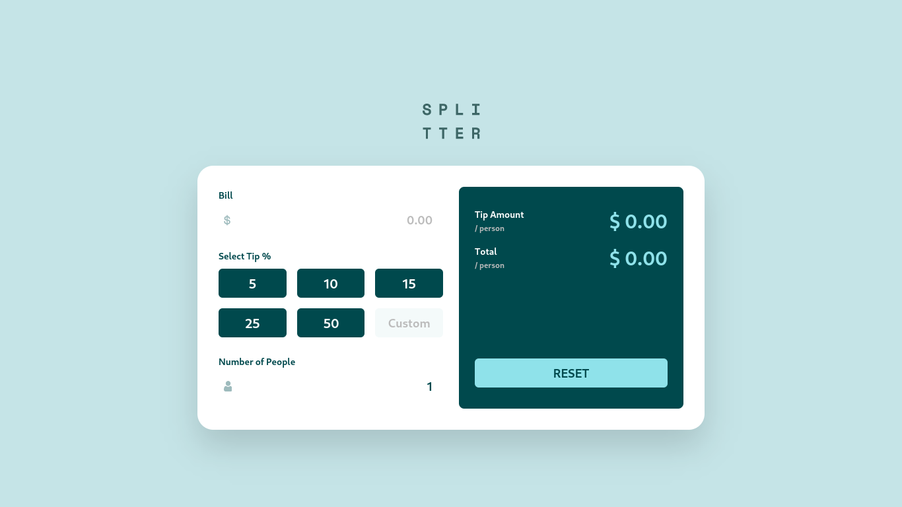

# Frontend Mentor - Tip calculator app

## Welcome! 👋

This purpose of this project is to practice tailwind css and a few of basic javaScript concepts. That include

- flex and grid layout
- creating tailwind custom components using directives
- customize theme

The algorithm for calculation is not complex in term of javaScript. But, there is a few thing to note in term of app functionality and user experience

- No form submit button since the function is attached to input fields. It will be triggered everytime user interact with one of the input fields.
- Therefore, The __Tip Amount__ and __Total__ fields will show the result everytime user changes or click one of the input fields.

### Design

### Result
